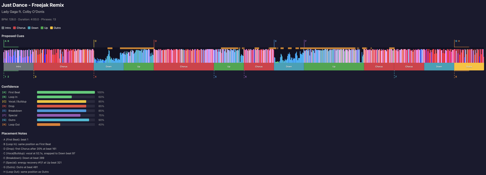

# djcues

Automated hot cue and memory cue placement for rekordbox, based on phrase analysis (PSSI), vocal detection (PVDI), and a standardized cue strategy.

djcues reads your rekordbox database, analyzes each track's phrase structure and vocal content, proposes cue placements following your cue system, and lets you review, adjust, and apply them back to the database.



## Installation

Requires Python 3.10+ and [uv](https://docs.astral.sh/uv/).

```bash
git clone <repo-url> && cd dj
uv sync
```

Run commands with `uv run djcues <command>`, or activate the venv first:

```bash
source .venv/bin/activate
djcues <command>
```

## Cue System

djcues uses a standardized 8 hot cue + 8 memory cue system defined in `cue-system.csv`:

| Pad | Hot Cue         | Color  | Memory Cue       |
|-----|-----------------|--------|-------------------|
| A   | First Beat      | Green  | First Beat        |
| B   | Loop In         | Green  | Loop In           |
| C   | Vocal / Buildup | Yellow | Before Buildup    |
| D   | Drop            | Red    | Before Drop       |
| E   | Breakdown       | Blue   | Before Breakdown  |
| F   | Special         | Purple | Before Special    |
| G   | Outro           | Cyan   | Before Outro      |
| H   | Loop Out        | Orange | Loop Out          |

Memory cues 3-7 are placed a configurable number of bars before their corresponding hot cue (default: 16 bars). Memory cues 1, 2, and 8 share the same position as their hot cue. Colors are standardized per slot.

To customize the cue system, edit `cue-system.csv` and update the `CUE_SYSTEM` definition in `src/djcues/constants.py`.

## Usage

### Preview cues for a track

```bash
djcues propose "Playlist Name" "Track Name"
```

### Visualize with waveform, phrases, and vocal detection

```bash
# Single track
djcues viz "Playlist Name" "Track Name"

# Entire playlist
djcues viz "Playlist Name" --all

# Compare proposals against existing cues
djcues viz "Playlist Name" "Track Name" --compare
```

### Review and apply cues

```bash
# Launch interactive review in browser
djcues review "Playlist Name" --all

# Apply accepted cues to rekordbox (requires rekordbox to be closed)
djcues apply <session-file.json>

# Preview what would be written
djcues apply <session-file.json> --dry-run
```

In the review UI:
- **Accept** / **Skip** per track or use **Accept All**
- Click a cue marker to select it, then use arrow keys to nudge by 1 bar
- Press Delete to skip an individual cue
- Memory cues auto-recalculate when you adjust their hot cue

### Compare accuracy against curated tracks

```bash
djcues compare "Processed" --all
```

## How It Works

1. **Phrase analysis (PSSI)**: rekordbox analyzes tracks into phrases (Intro, Up, Down, Chorus, Outro). djcues maps these to cue slots using heuristics — e.g., Drop aligns with the first Chorus after 20% of the track.

2. **Vocal detection (PVDI)**: rekordbox's vocal detection data (stored in `.2EX` ANLZ files) provides per-frame vocal confidence. djcues uses the first strong vocal onset to place the Vocal/Buildup cue.

3. **Waveform (PWV5)**: The color waveform detail data is extracted and rendered in the HTML visualizer for visual reference.

4. **Beat grid**: All cue positions are snapped to the beat grid for precise alignment.

## Safety

- **Auto-backup**: `djcues apply` automatically backs up `master.db` before writing
- **Overwrite protection**: Tracks with existing cues require explicit confirmation
- **Rekordbox must be closed**: The apply command will not write while rekordbox is running
- **Read-only by default**: `propose`, `compare`, `viz`, and `review` never modify the database
- **DB-only writes**: Cues are written to `master.db` only (not ANLZ files). rekordbox handles ANLZ sync on USB export.

## Configuration

| Option | Default | Description |
|--------|---------|-------------|
| `--offset` | 16 | Memory cue offset in bars before hot cue |
| `--loop-bars` | 4 | Loop length in bars for Loop In / Loop Out |

These are sane defaults for dance tracks, EDM, house, etc. with 8 bar phrases. If you're mixing hip hop, rock, r&b, or pop, or mixing more aggressively, try 16 bar offsets nad 2 bar loops. If you're mixing deeper forms of music with more overlap and longer phrasing, 32 bar offsets and 8 bar loops might be best. Use your ear and go with what feels right.

## Project Structure

```
src/djcues/
    models.py       # Data model (Track, CuePoint, Phrase, BeatGrid)
    constants.py    # PSSI mood tables, cue system definition, color maps
    db.py           # Rekordbox database reader
    strategy.py     # Cue placement heuristics
    viz.py          # HTML timeline visualizer
    review.py       # Interactive review HTML + session management
    server.py       # Local HTTP server for review sessions
    writer.py       # DB backup and cue writes
    cli.py          # Click CLI (propose, compare, viz, review, apply)
```

## License

BSD 3-Clause. See [LICENSE](LICENSE).

## Colophon

Under the hood, djcues leverages [pyrekordbox](https://pyrekordbox.readthedocs.io) to interact with the [Rekordbox](https://rekordbox.com) database. It also makes extensive use of [analysis files](https://pyrekordbox.readthedocs.io/en/latest/formats/anlz.html#) from Rekordbox. Other dependencies include [click](https://click.palletsprojects.com/en/stable/) and [pytest](https://docs.pytest.org/en/stable/).

This project was created in fleeting free moments with the help of [Claude Opus 4.6](https://www.anthropic.com/news/claude-opus-4-6) and [Superpowers](https://github.com/obra/superpowers).